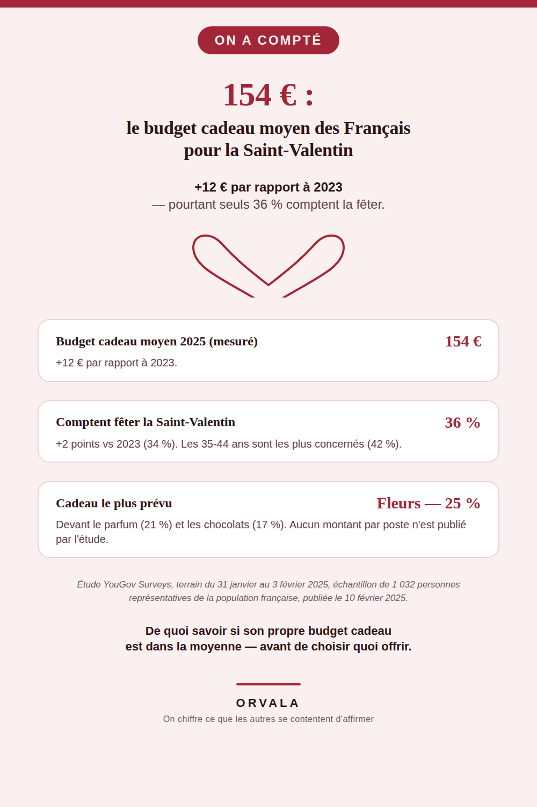

# Combien coûte la Saint-Valentin ?

**154 €** : c'est le budget cadeau moyen chez les couples qui comptaient fêter la Saint-Valentin
2025 — soit **12 € de plus qu'en 2023**. Seuls **36 %** des Français comptent la fêter (+2
points vs 34 % en 2023), avec un pic à 42 % chez les 35-44 ans.

## Ce qui est mesuré

| Indicateur | Chiffre |
|---|---|
| Budget cadeau moyen 2025 | **154 €** (+12 € vs 2023) |
| Comptent fêter la Saint-Valentin | **36 %** (+2 points vs 2023) |
| Pic par tranche d'âge | **42 %** chez les 35-44 ans |
| Cadeau le plus prévu | **Fleurs — 25 %** |
| 2e cadeau le plus prévu | **Parfum — 21 %** |
| 3e cadeau le plus prévu | **Chocolats — 17 %** |

## La source

Étude **YouGov Surveys**, terrain du **31 janvier au 3 février 2025**, échantillon de **1 032
personnes** représentatives de la population adulte française (méthode des quotas), publiée le
**10 février 2025**.

Page source vérifiée directement :
- https://yougov.com/fr-fr/articles/51555-saint-valentin-2025-quels-cadeaux-activites-et-budgets-prevoient-les-francais
  (redirection depuis fr.yougov.com/society/articles/51555-...)

Aucun chiffre de ce document n'a été recalculé ou extrapolé : ils sont recopiés tels que publiés
par l'institut.

## Complément : le budget fleurs, à part (ajouté le 2026-08-11)

Une décomposition en euros par poste de dépense restait introuvable au moment de la publication
initiale (voir « Ce qui manque » ci-dessous). Un chiffre distinct, propre à un seul poste, a depuis
été trouvé et vérifié directement à la source :

| Indicateur | Chiffre |
|---|---|
| Budget moyen fleurs/plantes pour la Saint-Valentin 2026 | **25,70 €** (vs 25,20 € en 2025) |
| Foyers acheteurs de fleurs/plantes pour l'occasion | **1,2 million** |

Selon **VALHOR** (interprofession française de l'horticulture et du fleurissement), citant un
**panel consommateurs Kantar pour FranceAgriMer et VALHOR** — page vérifiée directement :
https://www.valhor.fr/actualites/fleurs-et-plantes-achetees-pour-les-fetes

**À lire avec deux nuances :**
- Ce chiffre porte spécifiquement sur le poste *fleurs/plantes*, une sous-catégorie du budget
  cadeau global (154 €, YouGov, ci-dessus) — ce ne sont pas deux mesures du même total, elles ne
  s'additionnent pas et ne se comparent pas directement.
- Kantar est le prestataire qui a mesuré (panel d'achats réels, plus robuste qu'un sondage
  déclaratif). **VALHOR, qui diffuse ce chiffre, est l'organisme professionnel de la filière
  horticole** (financé par une cotisation obligatoire des producteurs/vendeurs, avec mission
  statutaire de développement du marché du végétal) — il a un intérêt direct à publier un chiffre
  qui progresse. Le chiffre est repris ici tel que mesuré par Kantar, sans reprendre l'angle
  promotionnel de VALHOR : c'est un constat, pas une incitation à dépenser plus.

## Ce qui manque, honnêtement

Contrairement aux 7 sujets précédents de cette série, **aucune décomposition complète en euros par
poste de dépense** (restaurant, cadeau hors fleurs, etc.) n'a pu être trouvée avec une source
primaire nommée — seul le poste fleurs (ci-dessus) a pu être isolé. Trois recherches successives
(YouGov elle-même, intotheminds.com, un croisement Halloween/santé/budget-parents chez
Cofidis-CSA) n'ont produit pour le reste que des fourchettes non sourcées (« plus de 100 € au
restaurant » sur creditnews.fr, sans institut nommé). Ce dépôt ne les reprend donc pas :
conformément à la règle de cette ligne éditoriale (« aucun chiffre inventé, jamais » —
consignes-vincent.md §10.4), seuls les chiffres directement vérifiés à la source sont utilisés.

## À propos

Ce dépôt accompagne une épingle Pinterest (compte `orvaladigital`) qui reprend ce chiffre pour le
rendre visible à celles et ceux qui veulent situer leur propre budget de Saint-Valentin par rapport
à la moyenne mesurée chez les couples qui la fêtent — pas pour donner un conseil d'économie.

## La série « On a compté »

Toute la série, avec un chiffre-titre par sujet : [github.com/VincentChabran](https://github.com/VincentChabran)

Ce dépôt fait partie d'une série qui chiffre et source ce que les autres se contentent d'affirmer, un sujet à la fois :

- [783 €/an pour un chien, 571 €/an pour un chat](https://github.com/VincentChabran/combien-coute-un-chien-un-chat)
- [19 293 €](https://github.com/VincentChabran/combien-coute-un-mariage)
- [environ 1 239,56 €](https://github.com/VincentChabran/combien-coute-un-demenagement)
- [488 €](https://github.com/VincentChabran/combien-coute-une-rentree-scolaire)
- [1 748 €](https://github.com/VincentChabran/combien-coutent-des-vacances-ete)
- [491 €](https://github.com/VincentChabran/combien-coute-noel)
- [490 €/mois](https://github.com/VincentChabran/combien-coute-un-bebe)
- [77 € vs 76 €](https://github.com/VincentChabran/combien-coute-la-fete-des-meres-et-des-peres)
- [85 € (étude 2024)](https://github.com/VincentChabran/combien-coute-halloween)
- [4 730 €](https://github.com/VincentChabran/combien-coute-des-obseques)
- [138 € à 344 €/mois de reste à charge selon le mode (2024)](https://github.com/VincentChabran/combien-coute-la-garde-d-enfant)
- [1 335 € pour 20h (35h en moyenne nécessaires)](https://github.com/VincentChabran/combien-coute-un-permis-de-conduire)
- [136 € (papiers d'identité perdus ou volés)](https://github.com/VincentChabran/combien-coute-papiers-identite-perdus)
- [2 250 € (accrochage responsable, 2025)](https://github.com/VincentChabran/combien-coute-un-accident-de-voiture)
- [14 221 €/an (étudiant·e décohabitant·e, 2026)](https://github.com/VincentChabran/combien-coute-une-rentree-etudiante)
- [14 069 € (incendie, 2025)](https://github.com/VincentChabran/combien-coute-un-sinistre-habitation)
- [3 128 €/mois (chambre non habilitée, 2024)](https://github.com/VincentChabran/combien-coute-un-ehpad)
